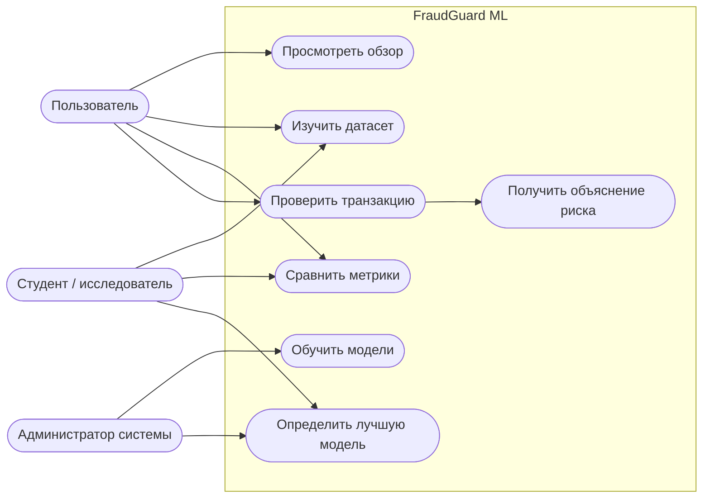
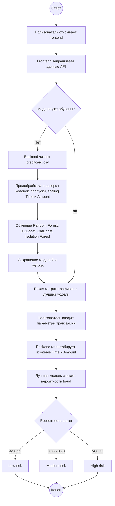
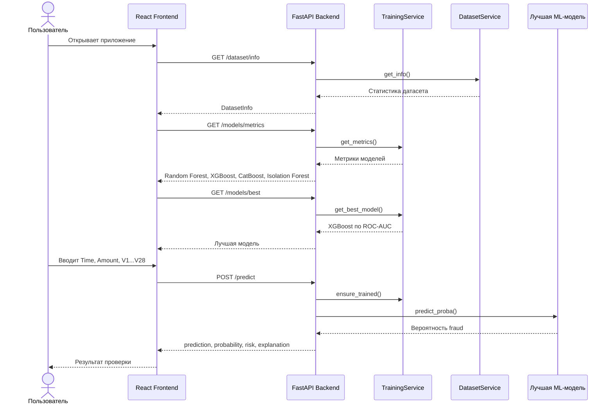
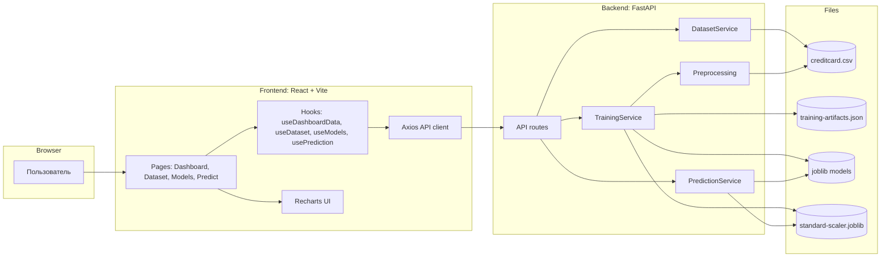
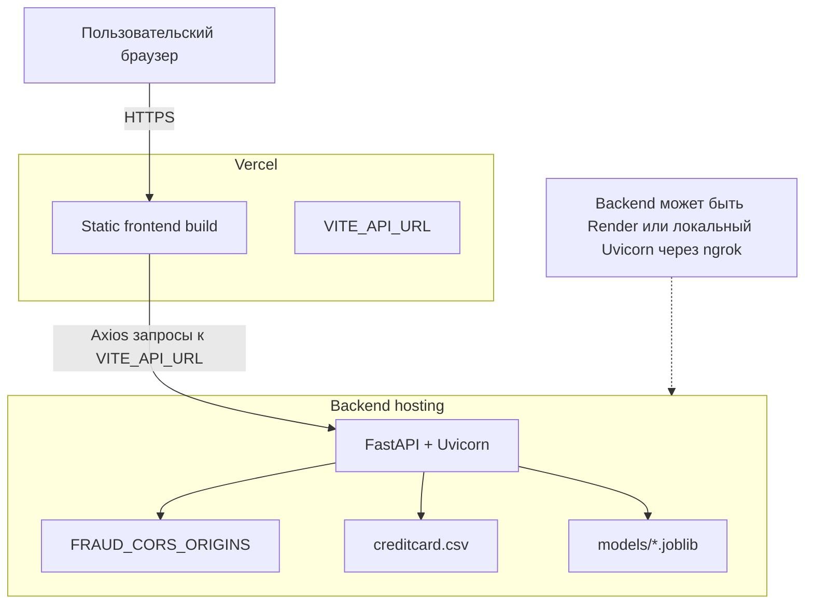
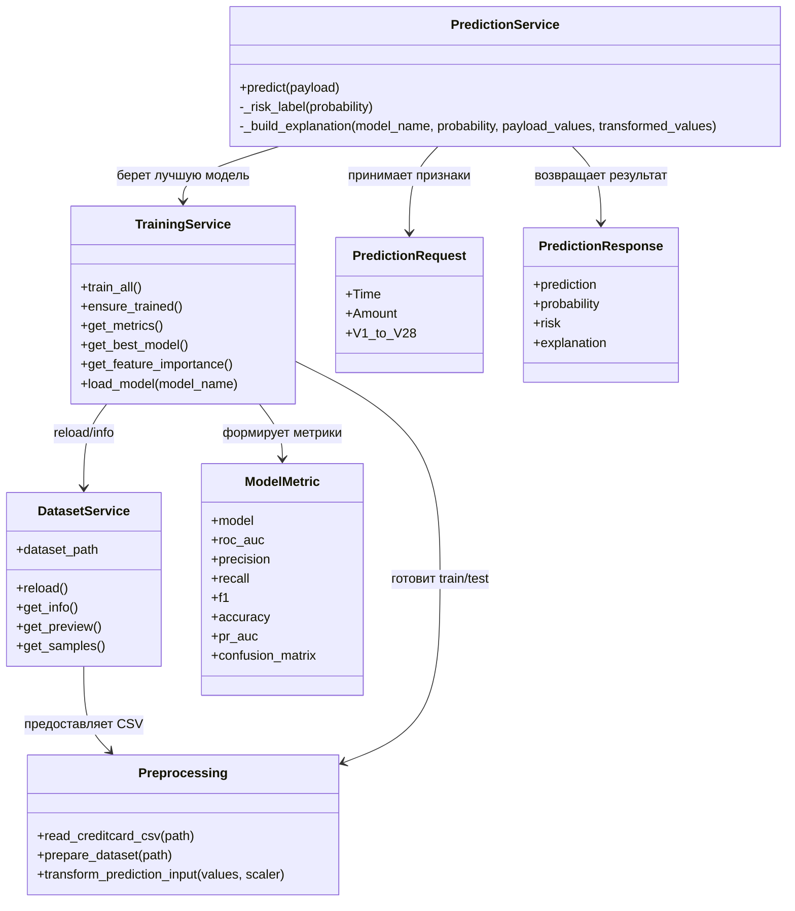

# FraudGuard ML

Fullstack-приложение для дипломного проекта **«Обнаружение мошеннических банковских транзакций с использованием методов машинного обучения»**.

В проекте нет мокнутого API и нет синтетического датасета. Backend обучает реальные модели на файле `backend/data/creditcard.csv`, который должен быть взят из Kaggle Credit Card Fraud Detection. Frontend получает данные только из FastAPI backend через Axios.

## Структура

```text
.
├── backend
│   ├── app
│   │   ├── api
│   │   ├── core
│   │   ├── ml
│   │   ├── schemas
│   │   ├── services
│   │   ├── utils
│   │   └── main.py
│   ├── data
│   │   └── creditcard.csv
│   ├── models
│   ├── Dockerfile
│   └── pyproject.toml
├── frontend
│   ├── src
│   │   ├── api
│   │   ├── components
│   │   ├── hooks
│   │   ├── pages
│   │   ├── types
│   │   ├── App.tsx
│   │   └── main.tsx
│   ├── Dockerfile
│   └── package.json
└── docker-compose.yml
```

## Датасет

Скачайте Kaggle Credit Card Fraud Detection dataset и положите CSV сюда:

```text
backend/data/creditcard.csv
```

Файл должен содержать колонки:

```text
Time, V1, V2, ..., V28, Amount, Class
```

Где `Class = 0` означает обычную транзакцию, а `Class = 1` означает мошенническую транзакцию.

Если файла нет, backend не будет подставлять демо-данные и вернет ошибку. Это сделано специально, чтобы в дипломном проекте не было моков.

## Запуск backend

```bash
cd backend
uv sync
uv run uvicorn app.main:app --reload
```

API будет доступен на:

```text
http://localhost:8000
```

## Запуск frontend

```bash
cd frontend
npm install
npm run dev
```

Интерфейс будет доступен на:

```text
http://localhost:5173
```

## Docker

```bash
docker compose up --build
```

Frontend:

```text
http://localhost:8080
```

Backend:

```text
http://localhost:8000
```

## Предобработка

Модуль `backend/app/ml/preprocessing.py` выполняет:

- чтение CSV;
- проверку обязательных колонок;
- обработку пропусков медианами;
- масштабирование `Time` и `Amount` через `StandardScaler`;
- `train_test_split` со `stratify`;
- `random_state=42`.

## Модели

Обучаются четыре модели:

- **Random Forest**
- **XGBoost**
- **CatBoost**
- **Isolation Forest**

Для каждой модели считаются:

- ROC-AUC
- Precision
- Recall
- F1-score
- Accuracy
- PR-AUC
- Confusion Matrix
- ROC Curve
- Precision-Recall Curve

Feature Importance рассчитывается для моделей, которые его поддерживают.

## API

| Метод | Endpoint | Назначение |
|---|---|---|
| GET | `/health` | Проверка доступности API |
| GET | `/dataset/info` | Информация о датасете |
| GET | `/dataset/preview` | Первые 20 строк датасета |
| POST | `/models/train` | Обучение всех моделей |
| GET | `/models/metrics` | Метрики моделей |
| GET | `/models/best` | Лучшая модель по ROC-AUC |
| GET | `/models/feature-importance` | TOP-15 важных признаков |
| POST | `/predict` | Предсказание риска для одной транзакции |

Пример `/predict`:

```json
{
  "Time": 0,
  "Amount": 120,
  "V1": 0,
  "V2": 0,
  "V3": 0,
  "V4": 0,
  "V5": 0,
  "V6": 0,
  "V7": 0,
  "V8": 0,
  "V9": 0,
  "V10": 0,
  "V11": 0,
  "V12": 0,
  "V13": 0,
  "V14": 0,
  "V15": 0,
  "V16": 0,
  "V17": 0,
  "V18": 0,
  "V19": 0,
  "V20": 0,
  "V21": 0,
  "V22": 0,
  "V23": 0,
  "V24": 0,
  "V25": 0,
  "V26": 0,
  "V27": 0,
  "V28": 0
}
```

Ответ:

```json
{
  "prediction": 1,
  "probability": 0.94,
  "risk": "High"
}
```

## Frontend

Страницы:

- **Обзор**: сводные карточки, распределение классов, качество моделей.
- **Датасет**: статистика и таблица первых 20 строк.
- **Модели**: сортируемая таблица метрик, Feature Importance, ROC Curve, Precision-Recall Curve, Confusion Matrix.
- **Предсказание**: форма для `Time`, `Amount`, `V1`-`V28`, badge риска и Progress вероятности.

Используются React 19, TypeScript, Vite, TailwindCSS, shadcn-style компоненты, React Router, Axios, Recharts и Lucide React.

## UML-диаграммы

Диаграммы написаны в формате Mermaid, поэтому они отображаются прямо в GitHub README.

### Use Case



### Activity Diagram



### Sequence Diagram



### Component Diagram



### Deployment Diagram



### Class Diagram


